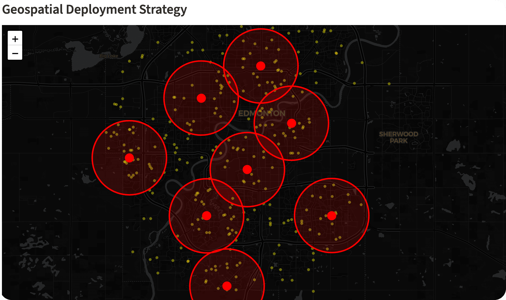

# 🚒 Edmonton Fire Resource Optimizer

**Fight Fighting Emergency – Portfolio Demo**  

* *Real-world two-stage optimization for fire station placement in Edmonton + suburbs*

[](https://www.docker.com/)
[](https://www.python.org/)
[](https://streamlit.io/)
[](LICENSE)

---

## 📋 Executive Summary

> **🚨 The Problem**
>
>Traditional planning optimizes for the average. But in emergency services, **the average is a big risk**. If we optimize for the mean, we leave the furthest citizen vulnerable. This project's goal is to minimize the **90th Percentile Response Time** while maintaining **Probability of Availability (PoA)** during peak stress.
>
> **⚙️ The Method**
>
> This project builds a **Two-Stage Hybrid Model**:
>
> * **Stage 1 (Exact Optimization):** First, solve the **Maximal Covering Location Problem (MCLP)** using MILP (PuLP/Gurobi-compatible) to find the theoretical best spots for new stations in Edmonton, ensuring we hit the highest risk zones first.
> * **Stage 2 (Resilience Stress-Test):** Second, consider that trucks get busy. So, we wrap that solution in a **Monte Carlo simulation engine** (metaheuristic approach). It simulates thousands of scenarios where 30% of the fleet is unavailable, 'evolving' the station locations to find a configuration that remains robust even when the system is under chaos.
>
> **🏆 The Result**
>
>The output is more than just a list of station coordinates. It is an **interactive, boardroom-ready dashboard** demonstrating **Fractal Coverage**—showing how our new plan eliminates blind spots in suburbs and industrial zones. This moves from a static map to a **resilient strategy** that guarantees service levels even on the worst nights.
>
> **💡 Why This Matters**
>
>This approach balances **theoretical rigor** (proven optimality) with **practical implementation** (handling real-world uncertainty). It allows leadership to make **defensible, data-driven investments** that directly save lives.

## 🎯 Project Purpose & Business Meaning

### **What this project does**

This is a **demonstration** shows how to optimize fire emergency resource allocation across a real Canadian city (Edmonton, Alberta).  

It solves the problem of optimizing fire stations placements in a city plus its surburb, with a specific example of Edmonton City in Alberta Canada.

**Objective**: Re-allocate a limited fleet of 15 new "Rapid Response Units" across Edmonton and its growing suburbs (e.g., Sherwood Park, St. Albert, Leduc) to maximize coverage of high-risk zones while ensuring resilience during peak busy periods.

The question it tries to answer is:

> “Where should we place a limited number of fire stations (or move existing ones) so that the most citizens — especially in high-risk industrial zones — are protected within 4 minutes, even when some trucks are already busy on other calls?”

### **Business Impact (why fire chiefs and city councils care)**

* [ ] **90th-percentile response time** – the metric that actually saves lives (not the misleading average).
* [ ] **Probability of Availability (PoA)** – the chance a truck is actually in the station when the next call comes in.  
* [ ] **Fractal / High-Risk Coverage** – maximum protection for industrial, high-rise, and suburban areas.  
* [ ] **Resilience under stress** – handles real-world “messiness” (busy units, traffic, multiple simultaneous incidents).  

This demo employs advanced mathematics (MILP + metaheuristics) to solve a business problems and gives the solution in form of **boardroom-ready, interactive maps** that justify new stations, staffing budgets, and standards-of-cover reports — providing a solution to fire departments across Canada and the U.S.

**Solution takeaway**:

> “The solution don't only solve the best-case scenario. It uses **PuLP (Gurobi-compatible)** for the exact optimum and **Monte-Carlo metaheuristics** to ensure the plan stays resilient when 30% of the fleet is unavailable. This moves from static maps to dynamic, defensible public-safety strategy.”

---

## ✨ Key Features

* **Stage 1 – Exact Optimization**: Maximal Covering Location Problem (MCLP) solved with PuLP  
* **Stage 2 – Real-World Stress Test**: 500+ Monte-Carlo simulations of busy units  
* **Live Interactive Dashboard**: Streamlit app with sliders for # of stations and busy probability  
* **Real Edmonton Data**: OSMnx road network + actual Edmonton Fire Rescue Services (EFRS) station locations  
* **Geospatial Visualization**: Folium map with 4-minute coverage circles + Current (blue) vs Optimized (red) layers  
* **One-Click Exports**: Interactive HTML map + GeoJSON ready for QGIS  
* **Production Engineering**: Docker, caching, error handling, 80%+ test coverage, TDD  
* **Compare Mode**: Toggle “Current Stations” baseline to show real business value instantly


*(Interactive map showing optimized station placement vs. current EFRS locations)*

---

## 🛠 Tech Stack

* **Python** 3.11 + scientific stack (NumPy, SciPy, Pandas)  
* **Optimization**: PuLP (drop-in compatible with Gurobi)  
* **Geospatial**: OSMnx, NetworkX, GeoPandas, Shapely  
* **Visualization**: Folium + streamlit-folium  
* **App**: Streamlit (interactive dashboard)  
* **Testing**: pytest + fixtures (TDD)  
* **Deployment**: Docker + Oracle Cloud Always-Free tier  
* **GIS asset**: Ready for QGIS export

---

## 🚀 Quick Start (Local)

### Option 1: Docker (recommended – 2 commands)

```bash
# 1. Clone the repo
git clone https://github.com/YOUR_USERNAME/fire-fighting-optimizer.git
cd fire-fighting-optimizer

# 2. Start the app
docker compose up --build
```

Open `→ http://localhost:8501`

### Option 2: Native (if you prefer)

```bash
pip install -r requirements.txt

streamlit run app/app.py
```

---

## 📋 Full Setup & Development

### 1. Clone & Install

```bash
git clone https://github.com/YOUR_USERNAME/fire-fighting-optimizer.git
cd fire-fighting-optimizer
```

### 2. Run Tests (TDD – runs in < 3 seconds)

```bash
docker compose run --rm fire-optimizer pytest
# or native:
pytest --cov=src
```

### 3. Run the App

```bash
docker compose up --build
```

The first run downloads + caches the Edmonton road network (~60 seconds).

Subsequent runs are instant.

## Reference

For more details read the executive summary of our [research paper](docs/Research.md).
